# Filament Resonator

A powerful email inbox plugin for [Filament 4](https://filamentphp.com) with [Resend](https://resend.com) integration and AI-powered features via [Prism](https://prism.echolabs.dev/).


## Features

- 📧 **Full Email Inbox** - Send, receive, and manage emails directly in Filament
- 🧵 **Thread Grouping** - Automatic conversation threading via headers
- 📁 **Folder Management** - Inbox, Sent, Archive, Spam, Trash + custom folders
- 🤖 **AI Spam Detection** - Automatic spam classification using Prism + LLM
- 👤 **Contact Enrichment** - Extract contact info from emails via AI
- 📝 **Reply Snippets** - Pre-defined templates for quick responses
- 🔄 **Auto Sync** - Scheduled syncing via artisan command
- 🌍 **Multilingual** - English and Swedish included

## Architecture Overview


## Technology Stack


## Data Model


## Email Sync Flow


## Reply Flow


## Installation

### Step 1: Install via Composer

```bash
composer require ekandreas/filament-resonator
```

### Step 2: Publish and run migrations

```bash
php artisan vendor:publish --tag="resonator-migrations"
php artisan migrate
```

### Step 3: Publish config (optional)

```bash
php artisan vendor:publish --tag="resonator-config"
```

### Step 4: Configure Prism

Resonator uses [Prism](https://prism.echolabs.dev/) for AI features. Configure your preferred provider in `config/prism.php`:

```php
// config/prism.php
return [
    'providers' => [
        'openai' => [
            'api_key' => env('OPENAI_API_KEY'),
        ],
        // Or use Anthropic, Ollama, etc.
    ],
];
```

### Step 5: Register the plugin

In your Filament Panel Provider:

```php
use EkAndreas\Resonator\ResonatorPlugin;

public function panel(Panel $panel): Panel
{
    return $panel
        // ...
        ->plugins([
            ResonatorPlugin::make(),
        ]);
}
```

## Configuration

### Environment Variables

```env
# Required - Resend
RESEND_KEY=re_xxxxxxxxxxxx

# Required for AI features - Choose one provider
OPENAI_API_KEY=sk-xxxxxxxxxxxx
# or
ANTHROPIC_API_KEY=sk-ant-xxxxxxxxxxxx

# Optional - Mail settings
RESONATOR_FROM_ADDRESS=hello@example.com
RESONATOR_FROM_NAME="My App"

# Optional - AI settings
RESONATOR_AI_ENABLED=true
RESONATOR_AI_PROVIDER=openai
RESONATOR_AI_MODEL=gpt-4o-mini

# Optional - Features
RESONATOR_SPAM_DETECTION=true
RESONATOR_CONTACT_ENRICHMENT=true
RESONATOR_CLEANUP_ENABLED=true
RESONATOR_CLEANUP_DAYS=30
```

### Config File

```php
// config/resonator.php

return [
    'resend' => [
        'key' => env('RESEND_KEY'),
    ],

    'mail' => [
        'from_address' => env('RESONATOR_FROM_ADDRESS'),
        'from_name' => env('RESONATOR_FROM_NAME'),
    ],

    'ai' => [
        'enabled' => env('RESONATOR_AI_ENABLED', true),
        'provider' => env('RESONATOR_AI_PROVIDER', 'openai'),
        'model' => env('RESONATOR_AI_MODEL', 'gpt-4o-mini'),
    ],

    'spam_detection' => [
        'enabled' => env('RESONATOR_SPAM_DETECTION', true),
        'delay_seconds' => 5,
    ],

    'contact_enrichment' => [
        'enabled' => env('RESONATOR_CONTACT_ENRICHMENT', true),
        'max_emails_to_analyze' => 3,
        'max_text_length' => 3000,
    ],

    'navigation' => [
        'group' => 'Resonator',
        'sort' => 100,
    ],

    'pagination' => [
        'default' => 25,
        'options' => [25, 50, 100],
    ],
];
```

## Prism AI Integration

Resonator leverages Prism's structured output feature for reliable AI responses:


### Spam Detection Schema

```php
$schema = new ObjectSchema(
    name: 'spam_detection',
    properties: [
        new BooleanSchema('is_spam'),
        new StringSchema('reason'),
    ],
    requiredFields: ['is_spam']
);
```

### Contact Enrichment Schema

```php
$schema = new ObjectSchema(
    name: 'contact_info',
    properties: [
        new StringSchema('name'),
        new StringSchema('phone'),
        new StringSchema('company'),
    ]
);
```

### Supported Prism Providers

| Provider | Model Examples | Config |
|----------|---------------|--------|
| OpenAI | `gpt-4o-mini`, `gpt-4o` | `OPENAI_API_KEY` |
| Anthropic | `claude-3-haiku`, `claude-3-sonnet` | `ANTHROPIC_API_KEY` |
| Ollama | `llama3`, `mistral` | Local installation |

## Plugin Options

```php
ResonatorPlugin::make()
    ->folders(true)      // Enable folder management
    ->snippets(true)     // Enable reply snippets
    ->spamFilters(true)  // Enable spam filter management
```

## Scheduled Syncing

Add to your `routes/console.php` or scheduler:

```php
use Illuminate\Support\Facades\Schedule;

Schedule::command('resonator:sync')->everyFiveMinutes();
```

Or in `app/Console/Kernel.php`:

```php
protected function schedule(Schedule $schedule): void
{
    $schedule->command('resonator:sync')->everyFiveMinutes();
}
```

## Command Reference

```bash
# Sync emails and cleanup old messages
php artisan resonator:sync

# Sync without cleanup
php artisan resonator:sync --no-cleanup

# Custom cleanup period
php artisan resonator:sync --cleanup-days=60
```

## Navigation Structure

```mermaid
graph LR
    subgraph "Resonator Menu Group"
        A[📥 Inbox] --> A1[View Threads]
        A --> A2[Compose]
        A --> A3[Sync]

        B[📁 Folders] --> B1[Manage Folders]

        C[📝 Snippets] --> C1[Manage Templates]

        D[🛡️ Spam Filters] --> D1[Manage Blocked]
    end
```



## System Folders

The following folders are created automatically:

| Folder | Slug | Icon | Purpose |
|--------|------|------|---------|
| Inbox | `inbox` | 📥 | Incoming messages |
| Sent | `sent` | 📤 | Outgoing messages |
| Archive | `archive` | 📦 | Archived threads |
| Spam | `spam` | 🛡️ | Spam messages |
| Trash | `trash` | 🗑️ | Deleted messages |

## AI Features

### Spam Detection Flow


### Contact Enrichment


## Thread Matching Logic


## Translations

Resonator includes English and Swedish translations. To add more languages:

```bash
php artisan vendor:publish --tag="resonator-translations"
```

Then create your translation file in `lang/vendor/resonator/{locale}/resonator.php`.

## Extending

### Custom Folder Types

```php
use EkAndreas\Resonator\Models\ResonatorFolder;

ResonatorFolder::create([
    'name' => 'VIP',
    'slug' => 'vip',
    'icon' => 'heroicon-o-star',
    'color' => 'warning',
    'is_system' => false,
]);
```

### Custom Snippets

```php
use EkAndreas\Resonator\Models\ResonatorSnippet;

ResonatorSnippet::create([
    'name' => 'Welcome Message',
    'shortcut' => 'welcome',
    'subject' => 'Welcome to Our Service',
    'body' => '<p>Thank you for reaching out...</p>',
    'is_active' => true,
]);
```

### Listening to Events

```php
// In a service provider
use EkAndreas\Resonator\Models\ResonatorEmail;

ResonatorEmail::created(function ($email) {
    if ($email->is_inbound) {
        // Notify team, trigger webhooks, etc.
    }
});
```

## File Structure

```
src/
├── Actions/
│   ├── CleanupOldMessages.php
│   ├── SendReply.php
│   └── SyncEmails.php
├── Commands/
│   └── SyncInboxCommand.php
├── Filament/
│   └── Resources/
│       ├── FolderResource.php
│       ├── InboxResource.php
│       ├── SnippetResource.php
│       └── SpamFilterResource.php
├── Http/
│   └── Integrations/
│       └── Resend/
│           ├── ResendConnector.php
│           └── Requests/
├── Jobs/
│   ├── DetectSpam.php
│   └── EnrichContact.php
├── Models/
│   ├── ResonatorAttachment.php
│   ├── ResonatorContact.php
│   ├── ResonatorEmail.php
│   ├── ResonatorFolder.php
│   ├── ResonatorSnippet.php
│   ├── ResonatorSpamFilter.php
│   └── ResonatorThread.php
├── ResonatorPlugin.php
└── ResonatorServiceProvider.php
```

## Testing

```bash
composer test
```

## Requirements

- PHP 8.4+
- Laravel 12.x
- Filament 4.x
- Resend account with API key
- LLM API key (OpenAI, Anthropic, or local Ollama)

## Dependencies

| Package | Version | Description |
|---------|---------|-------------|
| `php` | ^8.4 | PHP 8.4 or higher |
| `filament/filament` | ^4.0 | Filament admin panel (includes Livewire 3) |
| `illuminate/contracts` | ^12.0 | Laravel 12 contracts |
| `prism-php/prism` | ^1.0 | AI integration layer |
| `saloonphp/saloon` | ^3.0 | HTTP client for Resend API |
| `spatie/laravel-package-tools` | ^1.16 | Package development utilities |


## Changelog

Please see [CHANGELOG](CHANGELOG.md) for more information on what has changed recently.

## Contributing

Please see [CONTRIBUTING](CONTRIBUTING.md) for details.

## Security

If you discover any security related issues, please email security@elseif.se instead of using the issue tracker.

## Credits

- [Andreas Ek](https://github.com/ekandreas)
- [All Contributors](../../contributors)

## License

The MIT License (MIT). Please see [License File](LICENSE.md) for more information.
